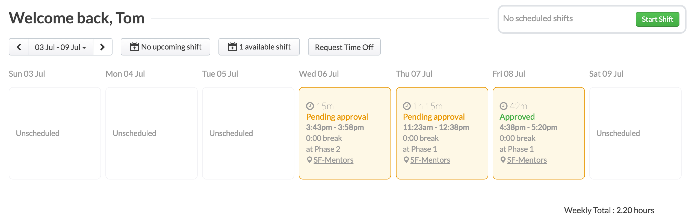

Deputy is a third Party Software used by DBC SF to schedule and administer Mentors shifts. It has a web and native mobile interface.

[DBC Deputy Tutorial](https://github.com/jbomotti/deputy_docs) - Images are mini video how-to's

You will use the [Deputy](https://sfmentors.na.deputy.com) app to:
  - Signup for shifts
  - Signin / Signout for your shift
  - See other Mentors on the schedule
  - Track your hours accurately

#### signin / signout:

Use Deputy Mobile for signing in/out of your shift.

A general how to can be found below in the Kiosk section.

#### Scheduling Details

  - Shifts for the upcoming phase will be published during week 2 of a phase.
  - You will receive an alert email at time of publication.
  - Signin to Deputy thereafter to claim shifts.
  - Currently, shift signup is first come first serve..
  - Deputy auto restricts hours you can signup for as follows:
    - Max 20 hours per week
    - Max 4 hours per shift
    - Max 8 hours per day
    - Max 5 days per week.

#### Structure

Shifts are split up into areas. As a mentor you will be assigned to one or more of these areas by the Mentor Coordinator. You will only see shifts that are included within your approved areas when signing up each phase. ie: Phase 1 & Workshops.

Areas:
  - (Open to all Mentors)
    - Evening Floater
    - Weekend Floater
    - Campus Tours
    - Marketing Event
  - (Assigned by Mentor Coordinator)
    - Phase 1
    - Phase 2
    - Phase 3
    - Workshops
  - (Require Mentor Coordinator approval)
    - Admissions / Interviews
    - Remote Support
    - Phase 0 Guide

#### Credentials

All Mentors should receive an invite to Deputy during onboarding. Please email the Mentor Coordinator with any issues.

#### TimeSheets

Deputy creates a timesheet entry whenever you complete a shift.
These sheets make an excellent reference when logging your hours in Workday.

**Pending VS Approval:**

If your signin/signout times for a scheduled shift are within a 1 hour variance of the scheduled time, the timesheet is auto approved a few minutes after the shift ends. The vast majority of your timesheets in Deputy should automatically update to 'approved' for this reason.

If you work a shift that is not scheduled in advance (ie: marketing event) or if you work a drastically different time than you were scheduled the timesheet will read 'Pending Approval'. You should add a comment as to the cause of the irregularity.

The Mentor Coordinator will review all 'Pending Approval' timesheets each week for legitness. Minor issues will be set to 'Approved'. Major issues will require a conversion.

**Important Notes:**
- Deputy timesheet entries DO NOT replace the requirement to report your hours in workday.
- Deputy timesheets are cross referenced by administration to Workday hour submissions.
- Workday hour submissions that do not sync with Deputy timesheets **will not be approved**.

#### Deputy Side Notes

- You can access Deputy via web or native mobile app. The mobile app is recommended.
- Please, upload your super nice looking cause it will be displayed on the infowall during your shift profile pic.
- Refresh often in the web client. Their AJAX workflow isn't stellar.
- I really didn't like the name Deputy at first, it has an under the thumb connotation that's no good. But it's grown on me. Three points as a historical aside:
  - Coaches => Core Coaches => Teaching Assistants => Mentors
  - Sherif Abushadi built the original Coaches program way back when.
  - So in some genealogical sense we're all kinda his deputies...
-Historical aside aside and back to the subject at hand, I tested several of these products with a few mentors and this was the best thing going.
- The app is capable of more than we need and that's OK. Just stick with the functionality detailed within the Wiki.
- Feedback encouraged :-)

