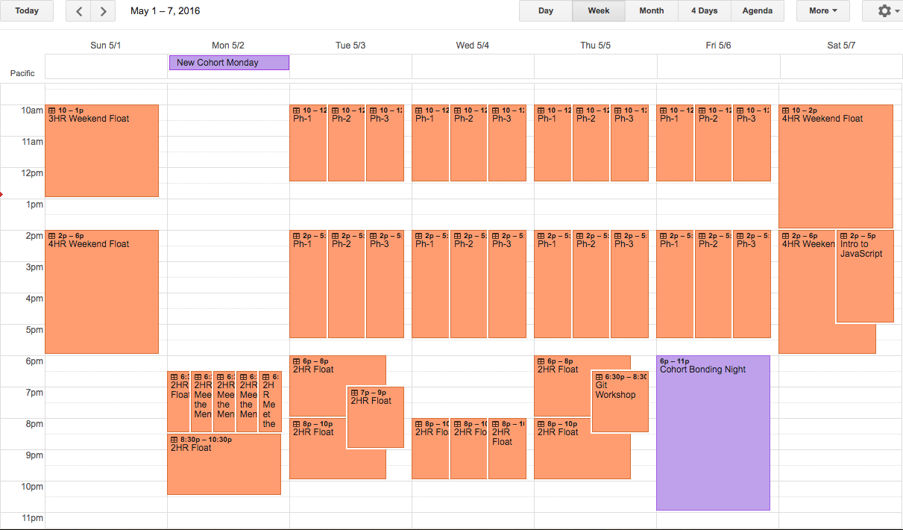
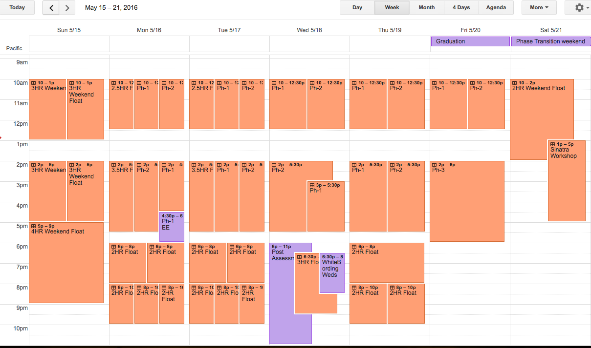

## Sessions

A session is time that you book to Mentor @ DBC. If you book a session you are expected to show up for that time slot. Session bookings will be cross-referenced to your Workday submissions.

### Booking:

#### Phasely Scheduling:

- Week 3 of the prior phase, all Mentors will choose from premade appointment slots for the upcoming phase.
- Selection of available slots is conducted over 3 rounds at times listed below.
- The first two rounds selections are limited to __5 hours per Mentor per week__ excluding preassigned slots. Additional hours can be picked up in the final round.
- Selection Rounds:
  - __Mentors currently employed as Devs__
    - Open: Week 2 Friday @ 7:00 PM
    - Close: Sunday @ 7:00 PM.
  - __Non-Employed Mentors__
    - Open: Sunday @ 7:00 PM Week 3
    - Close: Wednesday @ 7:00 PM Week 3.
  - Open Final Round: __All Mentors__
    - Open: Wednesday @ 7:00 PM of Week 3
    - All remaining slots (excluding those marked Ph-1/2/3 or workshops) are 'Up for grabs' to all Mentors, so long as it does not violate your 20 hour cap.

- Misc Details:
  - Current SF Mentor Calendar is void as of next phase and will be removed. (5/2/2016)
  - This approach utilizes appointment slots that only one Mentor can sign up for.
  - Day side slots marked Ph-1/2/3 will be filled by the Mentor Coordinator in advance of the first round.
  - Day side slots marked Float are available for booking from all Mentors, this will allow some 'non-core' mentors to get some day side exposure.
  - Fixed Sessions (workshops) are on the calendar but should only be booked by Mentors approved by the Mentor Coordinator.
  - Eligibility for the first round is determined by ```Column F``` in the [Mentor Status Sheet](https://docs.google.com/spreadsheets/d/1RgO926LYjNb4OuYwPOBIEkX3hjQNLmT-P99IEIxpmP0/edit?usp=sharing). All Mentors are encouraged to update this with current employment information.
  - [Canceling appointments](sessions.md#canceling_sessions)
  - Allows for the Mentor hours to be consumed across a phase where we see them having the greatest impact.
  - Appointment slot times are a solid guideline but do not have to be adhered to exactly. You can +- an hour here and there so long as your total hours for the day remain unchanged.
  - This is a first iteration and as such the layout will change.
  - Sure you have the ability to book appointments more than one phase in advance. Don't do it. I will delete any appointments not preassigned for the upcoming phase prior to selection rounds commencing.
  - This entire 'scheduling appointments' thing strictly relates to your primary role in floor support @ DBC. Miscellaneous Mentor usage elsewhere in our company will be logged on the Mentor Activities calendar. Detailed documentation forthcoming.... (Due 4/29/2016)

- Scheduling Penalties:
  - If you sign up for hours before your appointed time or outside of the constrictions listed, your slots for the phase will be forfeit.
  - If you miss an appointment without [canceling](sessions.md#canceling_sessions) it and finding a replacement / informing the Mentor Coordinator in advance, your slots for the rest of the phase will be forfeit.

#### Schedule Overview:

Current layout in a cleaner format:






Current weekly distribution of hours.

| Week 1 | Hours |
|------|---|
| Core - AM  | 30 |
| Core - PM  | 42 |
| Meet the Mentors | 08 |
| WorkShops  | 05 |
| Floating  | 20 |
| Weekend Floating  | 15 |

| Week 2 | Hours |
|------|---|
| Core - AM  | 32.5 |
| Core - PM  | 38.5 |
| Floating | 29 |
| Weekend Floating | 20|

| Week 3 | Hours |
|------|---|
| Core - AM | 30 |
| Core - PM | 37 |
| WorkShops | 04 |
| Floating | 29 |
| Weekend Floating | 20 |

#### Canceling Sessions:

If you book a session on the calendar but are unable to make it:

  - Cancel the appointment on your calendar.

    ```
    Select session to cancel
    Click "Cancel Appointment"
    Click 'Delete and Update Guests'
    ```
  - Reach out to a fellow Mentor and try to get the slot picked up.
  - If you find someone you're done.
  - Otherwise send an email to the Mentor Coordinator and let them know about the cancellation. They will email out to find a replacement.

#### Fixed Sessions:
Fixed sessions are workshops conducted by a Mentor. They can occur anytime after 6 on weekdays, or anytime over the weekend.

Taking on a Fixed session means taking on additional responsibilities. Mentors working on a fixed session may bill a limited number of 'prep hours' in addition to the actual time of the session. (Determined by the Mentor Coordinator)

Once scheduled, a fixed session should occur roughly at the same time and interval. Changes or substitutions need to be discussed with the Mentor Coordinator in advance. You may consider pairing with another Mentor for these, thus allowing some degree of flexibility while maintaining consistent deliver to students.

There are several fixed sessions available. If someone hasn't claimed a session you are interested in email the Mentor Coordinator to discuss picking it up.
  - White-boarding Wednesdays **John Akers**
  - Intro to Javascript Week 1 weekend **Stephanie Hutson**
  - Intro to Sinatra - Phase transition weekend **Jason Lo**
  - Intro to Git Workflow - Week 2 Monday **Hanah**
  - Intro to ReactJS - Week 1 Weekend **OPEN**
  - Advanced Git Workflow including rebase - **OPEN**
  - Intro to Rails - Phase transition weekend **OPEN**
  - Intro to JS Framework (your choice) - Week 2 weekend **OPEN**
  - ... (Suggestions Welcome)

### Session Cadence:

#### Before a Session:
- Review the challenges the students will be working by checking each of their phase guides in the respective cohort organizations. You can access these through your GitHub account. If you do not have access email the Mentor Coordinator.

#### During a Session:
- Write your name and session time on the board.
- Let the students know you're available.
- Sit at one of the tables at the end of the student workstations so you're easily accessible.
- Check regularly for students in a state of need.
- Take walks up and down the aisles every so often - some students don't ask questions unless you pass by.
- No questions from students... Break the ice with some general conversation angeling towards setting DBC culture.
- Nudge them in the right direction but don't always give them the answer straight up.
- If you notice bad habits starting to form, shut them down.
- Use your laptop to look up solutions from past cohort orgs if you're stuck.
- Don't spend too much time being stuck with a student - if you can't get them moving forward, ask another Mentor or Instructor.
- Remember, being a Mentor isn't all technical. Try to set a culture of hard work, kindness, determination, self empowerment and all around joyful interactions amongst humans and code the code they play with.
- Additionally, you can do code reviews. See [how to conduct code reviews](code-review.md) for instructions on how to do code reviews.
- If you're getting a lot of the same questions, consider doing a breakout on a topic. Check to see if the students would like one, and consider checking in with the phase lead to see if there's any info from their lecture that they would like you to reinforce.

#### After a Session:
- Remove your name from the board.
- Ensure any impactful interactions logged to [students notes](https://mentor.devbootcamp.com/)
- Complete the [End of Session](https://docs.google.com/a/devbootcamp.com/forms/d/1bNIBtgy2ephY5117eHa31iFVgVRxPJAA0zzyeEqvTlA/viewform) form.
